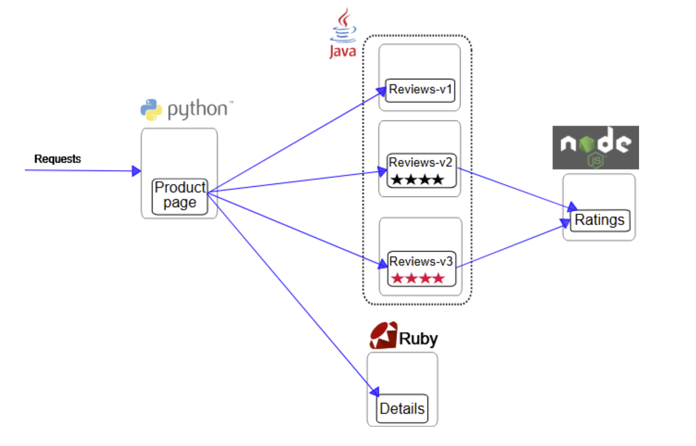
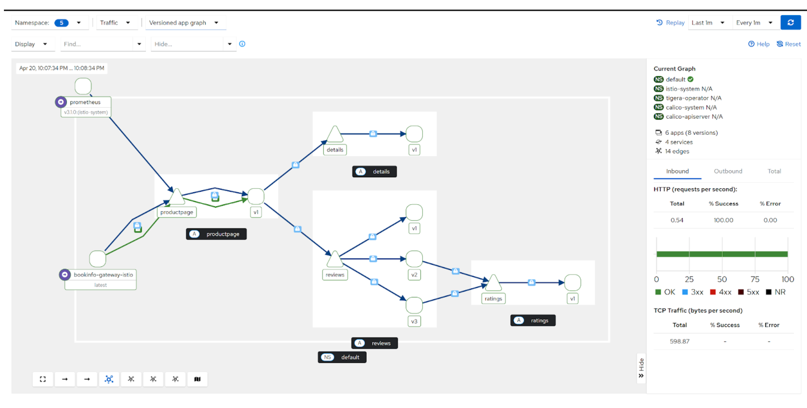
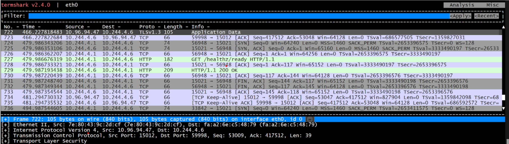
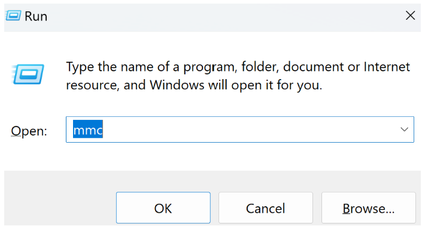
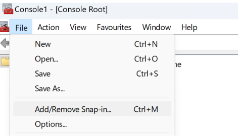
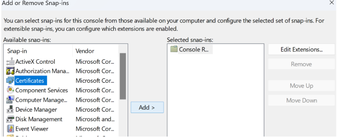
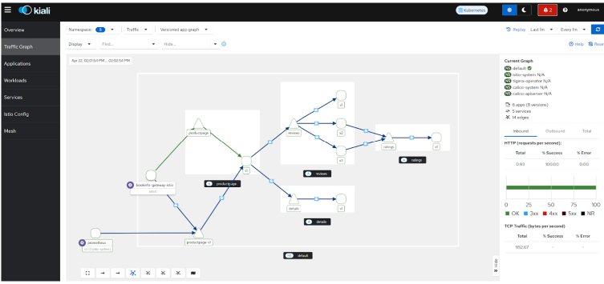

# Setting Up Kubernetes with Istio 1.25 on Windows Using Vagrant

This guide walks through setting up a Kubernetes cluster on Windows using Vagrant, VirtualBox, and Cygwin, with Istio 1.25 deployed in Ambient Mesh mode.
It will then use Istio's bookinfo example application and an Ingress Gateway to route
external client traffic into the Kubernetes cluster and backend pods.
The connection will take advantage of securing https traffic using Cert-Manager and self created 
certificates for the demo.

## Table of Contents
1. [Prerequisites](#10-preregs)
2. [Build Vagrant Hosts](#2-build-vagrant-hosts)
3. [Install Kubernetes](#3-install-kubernetes)
4. [Install Istio](#4-install-istio)
5. [Istio Sample Application](#5-istio-sample-application)
6. [Visualize with Kiali](#6-visualise-with-kiali)
7. [Cert Manager](#7-cert-manager)
8. [Enable mTLS Secure Mesh](#5-enable-mtlssecure-mesh)
9. [Appendix](#appendix-1)

---

## 1.0 Preregs

Before you begin, ensure you have the following installed and configured.

### 1.1 Install Vagrant
To begin, install Vagrant, a tool that helps you build and manage virtual machine environments in a simple and efficient way.
```bash
# Install from official site
https://www.vagrantup.com/downloads
```

### 1.2 Install VirtualBox
Next, you’ll need VirtualBox, which Vagrant uses to manage your virtual machines.
```bash
# Download from VirtualBox official site
https://www.virtualbox.org/wiki/Downloads
```

### 1.3 Install Cygwin
Cygwin provides a Linux-like environment on Windows. It's needed for running bash scripts that may not be natively supported in Windows.
```bash
# Follow installation instructions from Cygwin official site
https://www.cygwin.com/   
```

### 1.4 dos2unix
Converts Windows line endings to Unix format:
```bash
choco install dos2unix
dos2unix _start.sh
```

**Important**: Ensure that everything is working as expected before moving on to the next steps. 
Check that your installation is running without errors.

---

## 2. Build Vagrant Hosts

Now that you’ve installed all necessary software, it's time to set up the virtual machines for your Kubernetes cluster.

### 2.1 Checkout Vagrant Scripts
```bash
git clone https://github.com/nareshmaharaj-consultant/vagrant_for_kubernetes.git
```

### 2.2 Build VMs
Configure the allowed address space for Virtual Box. Only required once during set up.
```bash
mkdir /etc/box
# Add to /etc/vbox/networks.conf:
10.0.0.0/8 192.168.0.0/16  
2001::/64
```

Now you’re ready to build the VMs. Run the following script to start things off:
```bash
./_start.sh
```

Verify all the VMs are running:
```bash
vagrant status
```
You should see something like 
```text
Current machine states:
master                    running (virtualbox)
node01                    running (virtualbox)
node02                    running (virtualbox)
node03                    running (virtualbox)
```

---

## 3. Install Kubernetes

**Setting Up Kubernetes on Your Virtual Machines**

Now that your VMs are up and running, the next step is to deploy Kubernetes on them.

**Important Note:** We cannot use container-based Kubernetes distributions like Kind, K3s, or similar solutions. The Istio ambient mesh requires low-level networking modifications that are not supported in these environments.

Let’s proceed with a standard Kubernetes installation for your VMs ( _the hard way_ ).

### 3.1 Log into Each VM

In a new Cygwin shell window open an ssh connection to each Virtual Machine as follows.

```bash
vagrant ssh master
vagrant ssh node01
vagrant ssh node02
vagrant ssh node03
```

### 3.2 Run Setup Script
Inside each VM, run the setup script that installs and configures Kubernetes.
Use dos2unix to convert the file if you encounter any interpretation errors.
```bash
./setup-k8s.sh
```

Once the master node setup completes, it will provide you with the necessary commands to join the Kubernetes cluster.
You’ll need to run these join commands on each worker node to connect them to the cluster. 
The command will look something like this:
```text
sudo kubeadm join 10.0.0.10:6443 --token 14wpdz.sxivz9sp49t56a56 --discovery-token-ca-cert-hash sha256:249a10a62d32696090a6e8a0cb237423dfdff3a0fc35341eb69e0aa298321014
````

```bash
kubectl get nodes -w
```

---

## 4 Install Istio
If you want to use a Secure `https` connection for the external client install the cert-manager first in section 7 below.
But we recommend doing this mich later once you know you have a fully working application.

Install Istio using Helm and in Ambient Mesh mode.

**_Note_**: All the following commands are run from the master node, i.e. the kubernetes control plane.

### 4.1 Install Helm
```bash
curl -fssL -o get_helm.sh https://raw.githubusercontent.com/helm/helm/main/scripts/get-helm-3
chmod 700 get_helm.sh
./get_helm.sh
```

### 4.2 Add Repo to Helm
```bash
helm repo add istio https://istio-release.storage.googleapis.com/charts
helm repo update
```

### 4.3 Base components
```bash
helm install istio-base istio/base -n istio-system --create-namespace --wait
```

### 4.4 Kubernetes Gateway API

Using Kubernetes Gateway API Instead of Istio Ingress Gateway

We are opting for the Kubernetes Gateway API rather than the traditional Istio Ingress Gateway.

Why?
The Gateway API is the modern, standardized approach for managing traffic in Kubernetes and is designed to eventually replace the need for Istio's built-in Ingress and Egress Gateways.
```bash
kubectl get crd gateways.gateway.networking.k8s.io &> /dev/null || \
    kubectl apply -f https://github.com/kubernetes-sigs/gateway-api/releases/download/v1.2.1/standard-install.yaml
```

### 4.5 Istiod Control Plane
```bash
helm install istiod istio/istiod --namespace istio-system --set profile=ambient --wait
```

### 4.6 CNI Node Agent
```bash
helm install istio-cni istio/cni -n istio-system --set profile=ambient --wait
```

### 4.7 Ztunnel
```bash
helm install ztunnel istio/ztunnel -n istio-system --wait
```

### 4.8 Verify Pods Running
```bash
kubectl get pods -n istio-system

NAME                      READY   STATUS    RESTARTS   AGE
istio-cni-node-2sf68      1/1     Running   0          2m55s
istio-cni-node-484wj      1/1     Running   0          2m55s
istio-cni-node-czbsf      1/1     Running   0          2m55s
istio-cni-node-mzxd7      1/1     Running   0          2m55s
istiod-79f49d85c5-sqgzf   1/1     Running   0          3m19s
ztunnel-gw8mf             1/1     Running   0          73s
ztunnel-h79pj             1/1     Running   0          73s
ztunnel-kv4px             1/1     Running   0          73s
ztunnel-whv9g             1/1     Running   0          73s
```

---

## 5 Istio Sample Application

### 5.1 Download the Sample App

Use the following to download the sample application and istio tools.

```bash
curl -L https://istio.io/downloadIstio | sh -cd istio-1.25.2
export PATH=$PWD/bin:$PATH
```

### 5.2 Install the App



```bash
kubectl apply -f samples/bookinfo/platform/kube/bookinfo.yaml
kubectl apply -f samples/bookinfo/platform/kube/bookinfo-versions.yaml
```

### 5.3 Verify

Make sure all the pods are running:
```bash
kubectl get po
NAME                              READY   STATUS    RESTARTS   AGE
details-v1-649d7678b5-4sxd6       1/1     Running   0          45s
productpage-v1-5c5fb9b4b4-vnzzk   1/1     Running   0          45s
ratings-v1-794db9df8f-vl6p5       1/1     Running   0          45s
reviews-v1-7f9f5df695-jphnc       1/1     Running   0          45s
reviews-v2-65c9797659-mwzlk       1/1     Running   0          45s
reviews-v3-84b8cc6647-cmstq       1/1     Running   0          45s
````

### 5.4 Kubernetes Gateway API ( _not_ Istio )
```bash
kubectl apply -f samples/bookinfo/gateway-api/bookinfo-gateway.yaml
```

### 5.5 Remove Default Load Balancer
For non cloud environments remove the default load balancer 
that gets automatically created.

```bash
kubectl annotate gateway bookinfo-gateway networking.istio.io/service-type=ClusterIP --namespace=default
```

### 5.6 Verify running

```bash
kubectl get gateway
NAME               CLASS   ADDRESS                                            PROGRAMMED   AGE
bookinfo-gateway   istio   bookinfo-gateway-istio.default.svc.cluster.local   True         79s
```

### 5.7 Access the App
From a new shell window run the following on the master node.

```bash
kubectl port-forward svc/bookinfo-gateway-istio 8080:80
```
**_Note:_**  you cannot view the running app from the 
Vagrant host at <BLOCKQUOTE>http://localhost:8080/productpage</BLOCKQUOTE> without first configuring kubernetes port forwarding and Vagrant VM host traffic forwarding.

---

### 5.8 Setting Up Port Forwarding for bookinfo-gateway-istio from Vagrant Host

1. **Get the Master Node IP Address**  
   On the master node, run this command to find the 192.x.y.z address:
   ```bash
   ip a | grep 192 | grep eth1 | awk '{print $2}' | cut -f1 -d'/'
   ```
   Example output:  
   `inet 192.168.0.131/24 metric 100 brd 192.168.0.255 scope global dynamic eth1`


2. **Set Up SSH Port Forwarding**  
   From a new Windows terminal, establish an SSH tunnel using the IP address found above (password: `vagrant`):
   ```bash
   ssh -L 8080:localhost:8080 vagrant@192.168.0.131
   ```

3. **Access the Application**  
   After setting up the tunnel, open your web browser and visit:  
   <BLOCKQUOTE>[http://localhost:8080/productpage](http://localhost:8080/productpage)</BLOCKQUOTE>


---


## 6 Visualise with Kiali

Again from the master node lets add in the visualisation tools.
### 6.1 Install Kiali
```bash
kubectl apply -f samples/addons
```

### 6.2 Start Kiali

Expect to get an error here "cant reach host" - that's expected.
```bash
istioctl dashboard kiali
```

### 6.3 SSH Port Forwarding for Kiali
From a new cygwin shell, ssh-forward into the master node on the 192.x address we used earlier from 5.8.1. ( password: vagrant )
```bash
ssh -L 20001:localhost:20001 vagrant@192.168.0.131
```
Access via: <BLOCKQUOTE>http://localhost:20001/kiali</BLOCKQUOTE>

### 6.4 Client Web Requests
Fake some web client traffic so we can visualise some data in Kiali.
```bash
for i in $(seq 1 100); do curl -sSI -o /dev/null http://localhost:8080/productpage; sleep 1; done
```

### 6.5 Visualise with Kiali
Access Kiali <BLOCKQUOTE> http://localhost:20001/kiali</BLOCKQUOTE>

#### 6.5.1 No Security

Currently, without the Ambient Mesh added to the namespace you should see the following.


### 6.5.2 Enable Ambient Mesh
Add a new label to the default namespace.
```bash
kubectl label namespace default istio.io/dataplane-mode=ambient
```
Allow some time and you should see the graph change. Notice the 
tiny little padlocks denoting mtls traffic.



### 6.5.3 Debugging with Ambient Mesh ( Optional )

To see if data is encrypted via the Gateway run the following command.

```bash
kubectl debug -it bookinfo-gateway-istio-787fccdcdf-wrhqn --image=nicolaka/netshoot --image-pull-policy=Always --profile=general
````

Send an http request to the Ingress Gateway and monitor the Application Data.

You will need to start the tool with a command such as

```termshark -i eth0```

Notice the `mtls` protocol.



---

## 7 Cert Manager
cert-manager is a Kubernetes add-on that automates the management of TLS/SSL certificates. It handles:
 Issuing certificates from a variety of sources (e.g. Let’s Encrypt, HashiCorp Vault, your own internal CA). Renewing certificates automatically before they expire. Then storing certs as Kubernetes Secrets that can be used by Ingress, Gateways, webhooks, and apps.

### 7.1 Install Cert Manager
```bash
kubectl apply -f https://github.com/cert-manager/cert-manager/releases/download/v1.17.0/cert-manager.yaml
kubectl get pods --namespace cert-manager
```

### 7.2 Test Cert Manager

Test that the installation of cert manager went well and there are no issues.

```yaml
cat <<EOF > test-resources.yaml
apiVersion: v1
kind: Namespace
metadata:
  name: cert-manager-test
---
apiVersion: cert-manager.io/v1
kind: Issuer
metadata:
  name: test-selfsigned
  namespace: cert-manager-test
spec:
  selfsigned: {}
---
apiVersion: cert-manager.io/v1
kind: Certificate
metadata:
  name: selfsigned-cert
  namespace: cert-manager-test
spec:
  dnsNames:
    - example.com
  secretName: selfsigned-cert-tls
  issuerRef:
    name: test-selfsigned
EOF
```

Expect the describe of the certificate created to be similar to below.

```bash
kubectl describe certificate selfsigned-cert -n cert-manager-test

Name:         selfsigned-cert
Namespace:    cert-manager-test
Labels:       <none>
Annotations:  <none>
API Version:  cert-manager.io/v1
Kind:         Certificate
Metadata:
  Creation Timestamp:  2025-04-22T09:18:17Z
  Generation:          1
  Resource Version:    1515
  UID:                 193c1a3b-571d-436f-9b45-e5df1035f2b6
Spec:
  Dns Names:
    example.com
  Issuer Ref:
    Name:       test-selfsigned
  Secret Name:  selfsigned-cert-tls
Status:
  Conditions:
    Last Transition Time:  2025-04-22T09:18:17Z
    Message:               Certificate is up to date and has not expired
    Observed Generation:   1
    Reason:                Ready
    Status:                True
    Type:                  Ready
  Not After:               2025-07-21T09:18:17Z
  Not Before:              2025-04-22T09:18:17Z
  Renewal Time:            2025-06-21T09:18:17Z
  Revision:                1
Events:
  Type    Reason     Age   From                                       Message
  ----    ------     ----  ----                                       -------
  Normal  Issuing    116s  cert-manager-certificates-trigger          Issuing certificate as Secret does not exist
  Normal  Generated  116s  cert-manager-certificates-key-manager      Stored new private key in temporary Secret resource "selfsigned-cert-kphjp"
  Normal  Requested  116s  cert-manager-certificates-request-manager  Created new CertificateRequest resource "selfsigned-cert-1"
  Normal  Issuing    116s  cert-manager-certificates-issuing          The certificate has been successfully issued

```

### 7.3 Secure https

Just for testing we will use our self-managed Cluster Issuer and Certificate.
This is not advised for production but its ideal for our example and local testing.

#### 7.3.1 Create Issuer and Certificate
```yaml
# Issuer
cat <<EOF> cluster-issuer.yaml
apiVersion: cert-manager.io/v1
kind: ClusterIssuer
metadata:
  name: selfsigned-cluster-issuer
spec:
  selfsigned: {}
EOF

# Certificate
cat <<EOF> tls-cert.yaml
apiVersion: cert-manager.io/v1
kind: Certificate
metadata:
  name: bookinfo-gateway-cert
spec:
  commonName: bookinfo.example.com
  dnsNames:
    - bookinfo.example.com
  secretName: bookinfo-gateway-tls
  issuerRef:
    name: selfsigned-cluster-issuer
    kind: ClusterIssuer
EOF
```

### 7.3.2. Verify

It's always nice to verify and make sure things went well.

```bash
kubectl get ClusterIssuer
NAME                        READY   AGE
selfsigned-cluster-issuer   True    43s

kubectl get certificate
NAME                    READY   SECRET                 AGE
bookinfo-gateway-cert   True    bookinfo-gateway-tls   22s

```
### 7.3.3 Delete Current Gateway

We will replace the current Gateway to use the certificates we 
have just created above.
```bash
kubectl get gateway
NAME               CLASS   ADDRESS                                            PROGRAMMED   AGE
bookinfo-gateway   istio   bookinfo-gateway-istio.default.svc.cluster.local   True         39m

kubectl delete gateway bookinfo-gateway
gateway.gateway.networking.k8s.io "bookinfo-gateway" deleted
```


#### 7.3.4 Edit the Gateway
Make a copy of the current Gateway config then edit it:

Location: `samples/bookinfo/gateway-api/bookinfo-gateway.yaml`

Modified `bookinfo-gateway.yaml`:
```yaml
---
apiVersion: gateway.networking.k8s.io/v1
kind: Gateway
metadata:
  name: bookinfo-gateway
spec:
  gatewayClassName: istio
  listeners:
  - name: https                        # Secure https
    port: 443
    protocol: HTTPS
    tls:
      mode: Terminate
      certificateRefs:
      - kind: Secret
        name: bookinfo-gateway-tls
  allowedRoutes:
    namespaces:
      from: Same
---
apiVersion: gateway.networking.k8s.io/v1
kind: HTTPRoute
metadata:
   name: bookinfo
spec:
   parentRefs:
      - name: bookinfo-gateway
   rules:
      - matches:
           - path:
                type: Exact
                value: /productpage
           - path:
                type: PathPrefix
                value: /static
           - path:
                type: Exact
                value: /login
           - path:
                type: Exact
                value: /logout
           - path:
                type: PathPrefix
                value: /api/v1/products
        backendRefs:
           - name: productpage
             port: 9080


kubectl apply -f bookinfo-gateway.yaml

 > gateway.gateway.networking.k8s.io/bookinfo-gateway created
 > httproute.gateway.networking.k8s.io/bookinfo configured

```

### 7.3.5 Update /etc/hosts

On the master host update the hosts file to use the FQDN.

`127.0.0.1 bookinfo.example.com`

### 7.3.6 Port Forwarding

Close any previous port forwarding sessions and establish a new one this time using the FQDN.

```bash
kubectl port-forward svc/bookinfo-gateway-istio 8443:443
```

### 7.3.7 Download CA Cert

Would make sense to test our CA certificate and confirm it works in isolation.

```bash
kubectl get secret bookinfo-gateway-tls -o jsonpath="{.data['tls\.crt']}" | base64 -d > my-cert.crt
```

### 7.3.8 Test Connection

With our new certificate downloaded lets test it works.
```bash
curl -v --cacert my-cert.crt --resolve bookinfo.example.com:8443:127.0.0.1 https://bookinfo.example.com:8443

Output:

* Added bookinfo.example.com:8443:127.0.0.1 to DNS cache
* Hostname bookinfo.example.com was found in DNS cache
*   Trying 127.0.0.1:8443...
* Connected to bookinfo.example.com (127.0.0.1) port 8443 (#0)
* ALPN, offering h2
* ALPN, offering http/1.1
*  CAfile: my-cert.crt
*  CApath: /etc/ssl/certs
* TLSv1.0 (OUT), TLS header, Certificate Status (22):
* TLSv1.3 (OUT), TLS handshake, Client hello (1):
* TLSv1.2 (IN), TLS header, Certificate Status (22):
* TLSv1.3 (IN), TLS handshake, Server hello (2):
* TLSv1.2 (IN), TLS header, Finished (20):
* TLSv1.2 (IN), TLS header, Supplemental data (23):
* TLSv1.3 (IN), TLS handshake, Encrypted Extensions (8):
* TLSv1.3 (IN), TLS handshake, Certificate (11):
* TLSv1.3 (IN), TLS handshake, CERT verify (15):
* TLSv1.3 (IN), TLS handshake, Finished (20):
* TLSv1.2 (OUT), TLS header, Finished (20):
* TLSv1.3 (OUT), TLS change cipher, Change cipher spec (1):
* TLSv1.2 (OUT), TLS header, Supplemental data (23):
* TLSv1.3 (OUT), TLS handshake, Finished (20):
* SSL connection using TLSv1.3 / TLS_AES_256_GCM_SHA384
* ALPN, server accepted to use h2
* Server certificate:
*  subject: CN=bookinfo.example.com
*  start date: Apr 22 11:27:30 2025 GMT
*  expire date: Jul 21 11:27:30 2025 GMT
*  subjectAltName: host "bookinfo.example.com" matched cert's "bookinfo.example.com"
*  issuer: CN=bookinfo.example.com
*  SSL certificate verify ok.
* Using HTTP2, server supports multiplexing
* Connection state changed (HTTP/2 confirmed)
* Copying HTTP/2 data in stream buffer to connection buffer after upgrade: len=0
* TLSv1.2 (OUT), TLS header, Supplemental data (23):
* TLSv1.2 (OUT), TLS header, Supplemental data (23):
* TLSv1.2 (OUT), TLS header, Supplemental data (23):
* Using Stream ID: 1 (easy handle 0x55bbb4cca9f0)
* TLSv1.2 (OUT), TLS header, Supplemental data (23):
> GET / HTTP/2
> Host: bookinfo.example.com:8443
> user-agent: curl/7.81.0
> accept: */*
>
* TLSv1.2 (IN), TLS header, Supplemental data (23):
* TLSv1.3 (IN), TLS handshake, Newsession Ticket (4):
* TLSv1.3 (IN), TLS handshake, Newsession Ticket (4):
* old SSL session ID is stale, removing
* TLSv1.2 (IN), TLS header, Supplemental data (23):
* Connection state changed (MAX_CONCURRENT_STREAMS == 2147483647)!
* TLSv1.2 (OUT), TLS header, Supplemental data (23):
* TLSv1.2 (IN), TLS header, Supplemental data (23):
  < HTTP/2 404
  < date: Tue, 22 Apr 2025 11:53:28 GMT
  < server: istio-envoy
  <
* Connection #0 to host bookinfo.example.com left intact
```

### 7.3.9 Update Windows hosts file ( administrator )

Edit `C:\Windows\System32\Drivers\etc\hosts` adding 

`127.0.0.1 bookinfo.example.com`

From your local browser try: https://bookinfo.example.com:8443/productpage

### 7.3.10 Host Port Forwarding

```bash
ssh -L 8443:localhost:8443 vagrant@192.168.0.74
```

### 7.3.11 Import Certificate

Pressing the following keys Windows + R should bring up the command window.
Enter `mmc` and enter.



Choose File -> Add/Remove Snap-in



Choose Certificates -> Add -> Computer Account -> Finish



Left hand Menu -> Certificates -> Trusted Root Certificate
All Tasks -> Import.

Import the certificate my-cert.crt


Restart the Browser and then visit: https://bookinfo.example.com:8443/productpage


Run this from vm to see the looped https request like previously but now with https
```bash
for i in $(seq 1 10000); 
  do curl --cacert my-cert.crt -sSI -o /dev/null https://bookinfo.example.com:8443/productpage;sleep 1; 
done
```



---

### Appendix 1: API Gateway Example

#### GatewayClass
```yaml
apiVersion: gateway.networking.k8s.io/v1  
kind: GatewayClass  
metadata:  
  name: istio  
spec:  
  controllerName: istio.io/gateway-controller
```

#### Gateway
```yaml
apiVersion: gateway.networking.k8s.io/v1
kind: Gateway
metadata:
  name: my-gateway
  namespace: default
spec:
  gatewayClassName: istio
  listeners:
  - name: http
    protocol: HTTP
    port: 80
    hostname: "example.com"
```

#### HTTPRoute
```yaml
apiVersion: gateway.networking.k8s.io/v1
kind: HTTPRoute
metadata:
  name: my-route
  namespace: default
spec:
  parentRefs:
  - name: my-gateway
  hostnames:
  - "example.com"
  rules:
  - matches:
    - path:
        type: PathPrefix
        value: /
    backendRefs:
    - name: my-service
      port: 80
```

---

## Key Differences: Old vs Gateway API

| Feature          | Old Istio CRDs                     | Gateway API                     |
|------------------|------------------------------------|---------------------------------|
| Ingress Gateway  | Created via Helm/istioctl          | Configured via Gateway resource |
| Gateway Config   | networking.istio.io/v1beta1        | gateway.networking.k8s.io/v1    |
| Route Definition | VirtualService                     | HTTPRoute/TCPRoute              |

The Gateway API provides a more standardized approach to configuring ingress in Kubernetes, while Istio implements the control plane that enacts these configurations.

---

## Appendix 2: Alternative Kubernetes Installations

### Kind Configuration
```yaml
kind: Cluster
apiVersion: kind.x-k8s.io/vialpha4
nodes:
- role: control-plane
- role: worker
- role: worker
```

### k3d Installation
```bash
k3d cluster create --api-port 6550 -p '9080:80@loadbalancer' -p '9443:443@loadbalancer' --agents 2 --k3s-arg '--disable=traefik@server:*'
```

---

## Appendix 3: Network Tools

Debug with netshoot:
```bash
kubectl debug -it details-v1-7c5d957895-7wb6d --image=nicolaka/netshoot --image-pull-policy=Always --profile=general
```

Packet capture:
```bash
POD=$(kubectl get pods -l app=details -o jsonpath="(.items[0].metadata.name)")
kubectl debug $POD -i --image=nicolaka/netshoot -- tcpdump -nAi eth0 port 9080 or port 15008
```

---

## Links
- [K3d Documentation](https://k3d.io)
- [Istio Official Site](https://istio.io)
- [Kubernetes Gateway API](https://gateway-api.sigs.k8s.io)
